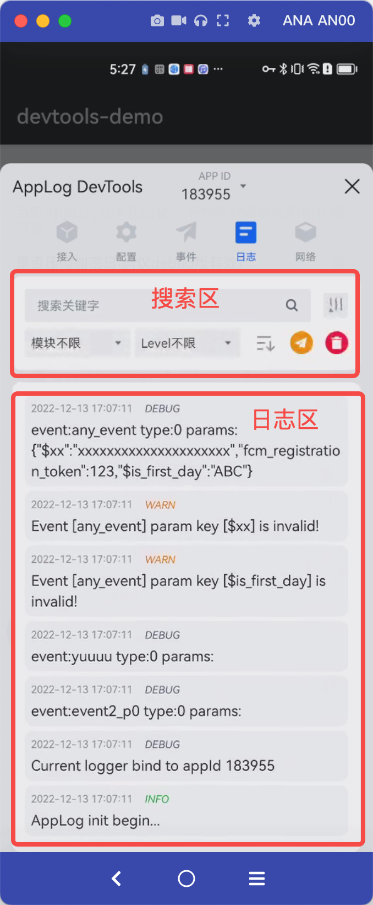

# flutter_adspark

Flutter 版的 AdSpark 主要功能广告监测、增长分析、归因上报、事件管理(巨量引擎、巨量广告、穿山甲)

## 支持平台

- 穿山甲
- 巨量引擎
- 巨量广告

## 核心功能
- ✅ 激活
- ✅ 注册
- ✅ 支付
- ✅ 账户登录、登出
- ✅ 绑定社交账号
- ✅ 完成教学任务/副本
- ✅ 升级
- ✅ 创建角色
- ✅ 查看内容/商品详情
- ✅ 添加到购物车
- ✅ 提交购买/下单
- ✅ 添加支付渠道
- ✅ 数据检测
- ✅ 自定义事件
- 📱 可视化测试助手

## 开始接入

> 在项目根目录下新建一个 'plugins' 文件夹，将我提供 'flutter_adspark.zip' 压缩包解压至此文件夹

``` yaml
dependencies:
  flutter_adspark: 
    path: plugins/flutter_adspark # 本地引入
```

## 可视化测试助手

> 为了方便开发者调试，提供了可视化助手，方便开发者查看数据上报情况

|功能区|事件区|日志区|网络区|
|--|--|--|--|
|  |  |  |  |


## 使用方法

### 初始化

``` dart
import 'package:flutter_adspark/flutter_adspark.dart';

Future<void> init() async {
    bool? result;
    if (Platform.isAndroid) {
      result = await FlutterAdspark.init("appid", "huawei");
    } else {
      result = await FlutterAdspark.init("appid", "AppStore");
    }
    print("FlutterAdspark init result: $result");
  }
```

### 事件上报

``` dart
/// 上报事件（系统+自定义）
/// [eventName] 事件名称
/// [params] 参数信息
FlutterAdspark.addEvent(GrownEventType.order, params: {
                        "orderId": "54323454323",
                        "amount": 2000,
                        "count": 1,
                      });
```

### 系统事件

- 注册
``` dart
/// 注册事件（系统）
/// [method] 注册方式
/// [isSuccess] 是否成功
FlutterAdspark.registerEvent("wechat", true);
```

- 其他事件看文档

### 常用事件

> 如果够用，则直接使用，不沟通则自己传字符串即可

``` dart
class GrownEventType {
  //注册
  static var register = "grown_attribution_event_register";
  //付费
  static var purchase = "grown_attribution_event_purchase";
  //关键行为
  static var key_behavior = "grown_attribution_event_key_behavior";
  //下单
  static var order = "grown_attribution_event_order";
  //下载
  static var download = "grown_attribution_event_download";
  //应用内拉起
  static var deeplink = "grown_attribution_event_deelink";
  //授权
  static var authorization = "grown_attribution_event_authorization";
  //广告变现
  static var ad_purchase = "grown_attribution_event_ad_purchase";
  //次留
  static var retention_2d = "grown_attribution_event_retention_2d";
  //添加购物车
  static var add_to_cart = "grown_attribution_event_add_to_cart";
  //表单提交
  static var form_submit = "grown_attribution_event_form_submit";
  //拉活
  static var app_re_active_wake_up =
      "grown_attribution_event_app_re_active_wake_up";
  //自定义激活
  static var custom_activition = "grown_attribution_event_custom_activition";
  //自定义注册
  static var custom_register = "grown_attribution_event_custom_register";
}
```

## 官方文档

- [穿山甲～Android](https://bytedance.larkoffice.com/wiki/Yh8qwfiiIivBaKkYFYAcZedTnJf)
- [穿山甲～iOS](https://bytedance.larkoffice.com/wiki/YcpCwVKdFi0VUxk4EAjc6TuJnre)
- [巨量广告～文档](https://event-manager.oceanengine.com/docs/8650/195169)

## 关于项目

- 开发者：[FlutterAds(致力于构建优质的 Flutter 广告插件)](https://github.com/FlutterAds)
- 此版本没有具体功能，[获取 Pro 版本完整功能](https://flutterads.github.io/site/)