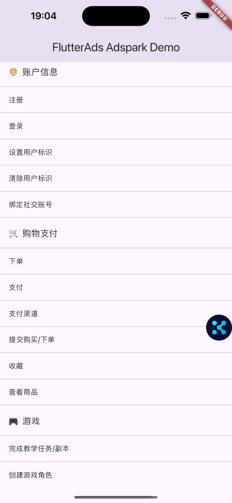
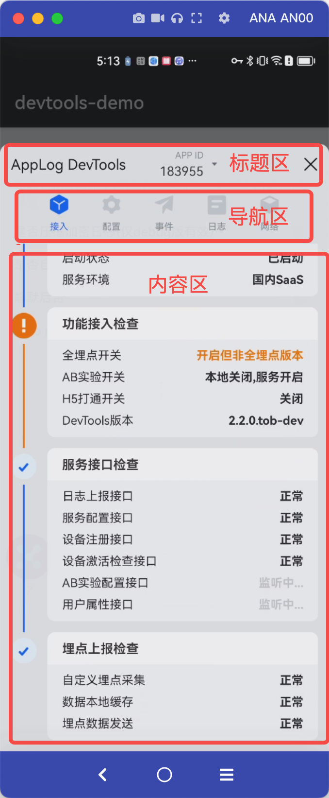
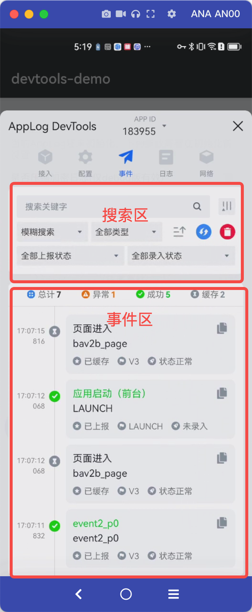
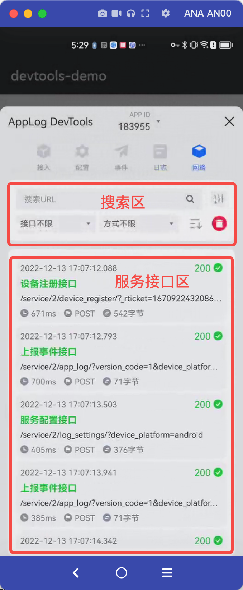

<h1 align="center">Flutter AdSpark Pro</h1>
<h5 align="center">一款优质的广告监测、增长分析、归因上报、事件管理插件（巨量广告、穿山甲）</h5>

<a href="https://pub.dev/packages/flutter_adspark">
<a href="https://flutterads.top/"> 
<a href="https://flutterads.top/">
<a href="https://flutterads.top/">

## 💻 支持平台

- 穿山甲
- 巨量引擎
- 巨量广告

## 🚀 核心功能
- ✅ 激活
- ✅ 注册
- ✅ 支付
- ✅ 账户登录、登出
- ✅ 绑定社交账号
- ✅ 完成教学任务/副本
- ✅ 升级
- ✅ 创建角色
- ✅ 查看内容/商品详情
- ✅ 添加到购物车
- ✅ 提交购买/下单
- ✅ 添加支付渠道
- ✅ 数据检测
- ✅ 自定义事件
- 📱 可视化测试助手

## 🧪 示例&测试助手

> 为了方便开发者调试，提供了可视化助手，方便开发者查看数据上报情况

|示例接口|功能区|事件区|网络区|
|--|--|--|--|
| | |   |  |

## 📃 接入文档

- [ 极速接入、快速体验、永久更新](https://flutterads.top/start/guide/adspark/install.html)

## 📌 广告系列插件（FlutterAds）
|插件|描述|
|-|-|
|[flutter_gromore_pro](https://flutterads.top/)|🏆🏆🏆 帮你大幅提升广告收益，发挥出最大的用户价值|
|[flutter_gromore_ads](https://github.com/FlutterAds/flutter_gromore_ads)|字节跳动、穿山甲、GroMore 聚合 Flutter 广告开源版插件|
|[flutter_pangle_ads](https://github.com/FlutterAds/flutter_pangle_ads)|字节跳动、穿山甲 Flutter 广告插件|
|[flutter_qq_ads](https://github.com/FlutterAds/flutter_qq_ads)|腾讯广告、广点通、优量汇 Flutter 广告插件|
|[flutter_adspark](https://github.com/FlutterAds/flutter_adspark)|巨量广告/穿山甲的广告监测、增长分析、归因上报、事件管理 Flutter 版插件|
|[flutter_adcontent](https://github.com/FlutterAds/flutter_adcontent)|穿山甲内容输出 Flutter 版插件，支持短剧和小视频|
